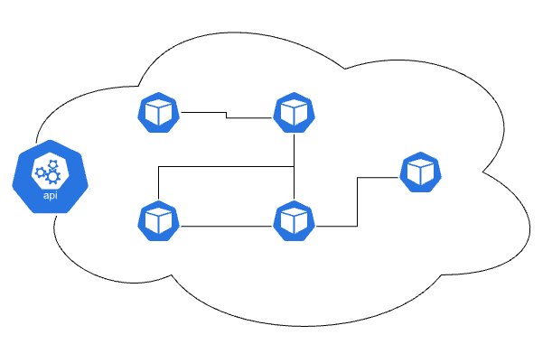
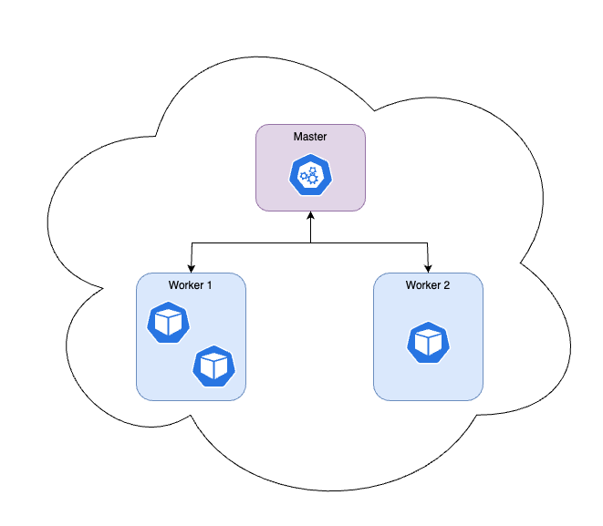
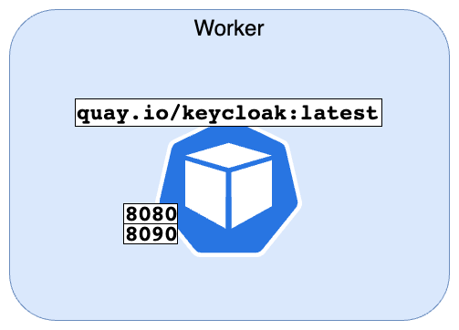
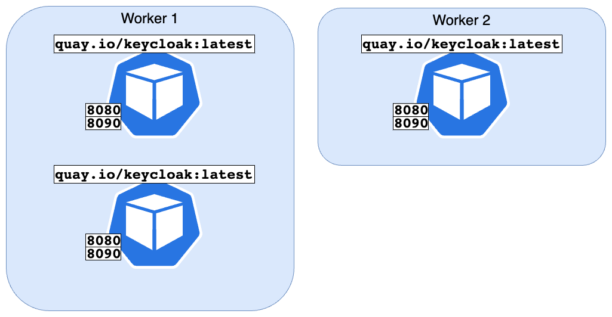
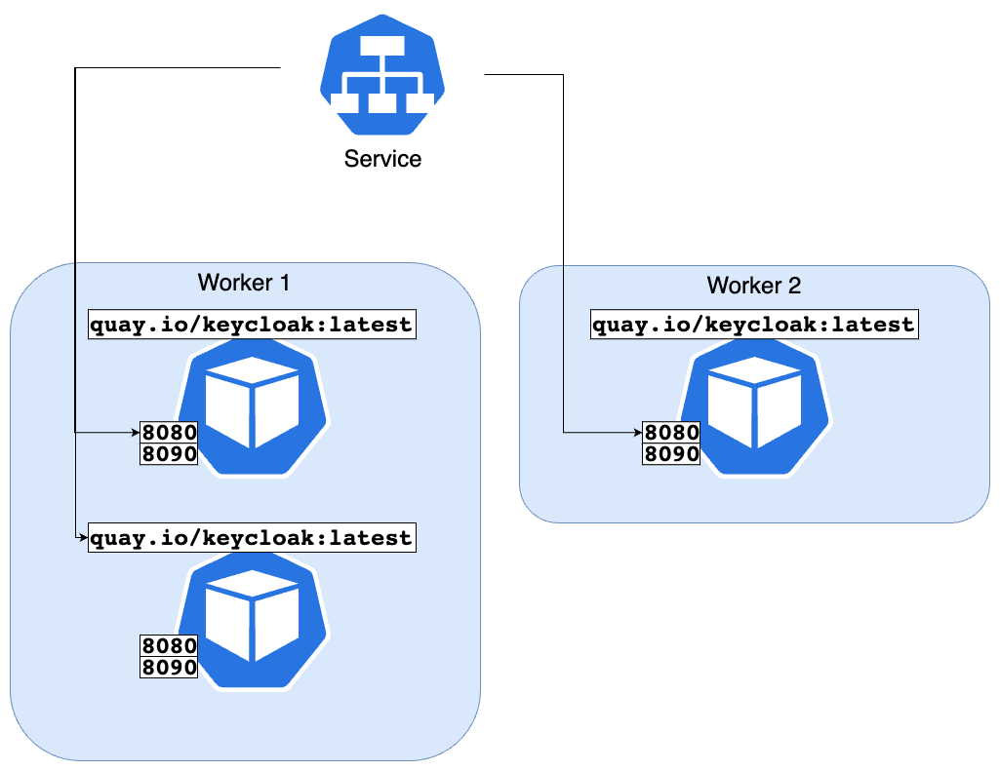
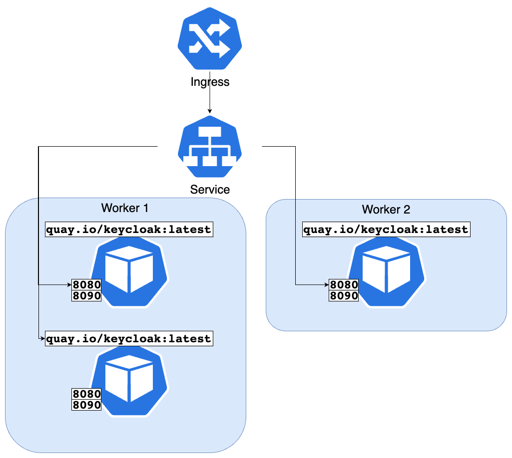

# Short and sweet

## Kubernetes / Helm Basics

---

# Kubernetes (K8s)

* "production grade container orchestrator"
* Features
  * High availability / Fault tolerance
  * Auto-scaling
  * Zero-downtime deployment
  * Load balancing

---

# Kubernetes cluster



* The “Kubernetes application” in which containers can be deployed
* Consists of at least 1 node
* Concrete implementations:
  * AKS – Azure Kubernetes Service
  * EKS – Elastic Kubernetes Service (AWS)
  * GKE – Google Kubernetes Engine

---

# Node




* A cluster of 1 ... n nodes
* Physical server or virtual machine
* Master node vs worker node
* Worker nodes run containers

<!-- _note: 

-->

---

# Task - Nodes

How many nodes does the Dish dev cluster have?

```bash
kubectl get nodes
```

<!-- _note: 

-->

---

# Namespace


* "folder" for all resources in a Kubernetes cluster
* only nodes are not assigned to a namespace

<!-- _note: 

-->

---

# Task - Namespace

Create your own namespace in the Dev cluster:

```bash
kubectl create namespace <your-name>-test --dry-run=client -o yaml > namespace.yaml

kubectl apply -f namespace.yaml

kubectl get namespaces
```

<!-- _note: 

-->

---

# Pod




* A deployed container
* Described by:
  * Container image
  * Environment variables
  * Ports
  * Protocols
  * …

<!-- _note: 

-->

---

# Task - Pod

Deploy a [podinfo pod](https://github.com/stefanprodan/podinfo) in your namespace:

```bash
kubectl run podinfo \
  --image=stefanprodan/podinfo \
  --restart=Never \
  --dry-run=client \
  --namespace=<your-namespace> \
  -o yaml > podinfo-pod.yaml

kubectl apply -f podinfo-pod.yaml -n <your-namespace>

kubectl get pods -n <your-namespace>

kubectl port-forward pod/podinfo 9898:9898 -n <your-namespace> # works also via OpenLens

# Open in browser http://localhost:9898

# Make the pod terminate and see how it restarts
curl localhost:9898/panic

kubectl get pods -n <your-namespace>

kubectl delete -f podinfo-pod.yaml
```

<!-- _note: 

-->

---

# Deployment (deploy)




* Scaling an image
* update options

<!-- _note: 

-->

---

# Task - Deployment

Deploy a [podinfo pod](https://github.com/stefanprodan/podinfo) as a deployment in your namespace:

```bash
kubectl create deployment podinfo-deploy \
  --image=stefanprodan/podinfo \
  --replicas=2 \
  --dry-run=client \
  --namespace=<your-namespace> \
  -o yaml > deployment.yaml

kubectl apply -f deployment.yaml -n <your-namespace>

kubectl get deployments -n <your-namespace>

kubectl get rs -n <your-namespace>

kubectl get pods -n <your-namespace>

kubectl scale deployment podinfo-deploy --replicas=3 -n <your-namespace>

# kubectl delete -f deployment.yaml
```

<!-- _note: 

-->

---

# Service



* Provides a stable network endpoint to access Pods

* Pods are ephemeral (IP addresses change frequently)

* A Service solves this by:
  * Offering a fixed IP and DNS name
  * Load balancing traffic
  * Selecting Pods using labels

* Enables reliable communication between components inside a cluster

<!-- _note: 

-->

---

# Task - Service

Deploy a K8s service for the existing deployment in your namespace:

```bash
kubectl expose deployment podinfo-deploy \
  --name=podinfo-svc \
  --port=9898 \
  --target-port=9898 \
  --type=ClusterIP \
  --namespace <your-namespace> \
  --dry-run=client \
  -o yaml > service.yaml

kubectl apply -f service.yaml -n <your-namespace>

kubectl get svc -n <your-namespace>

kubectl port-forward svc/podinfo-svc 9898:9898 -n <your-namespace>

# kubectl delete -f service.yaml
```

<!-- _note: 

-->

---

# Ingress



* Manages external HTTP/HTTPS access to Services in a cluster

* Acts as a smart router for incoming traffic

* Provides:
  * URL-based routing
  * Host-based routing
  * Centralized entry point for applications

<!-- _note: 

-->

---

# Task - Ingress

Deploy a K8s Ingress and point it to the service in your namespace:

```bash
# Update the file tasks/task-ingress/ingress.yaml

kubectl apply -f tasks/task-ingress/ingress.yaml -n <your-namespace>

kubectl get ingress -n <your-namespace>

kubectl port-forward svc/podinfo-svc 9898:9898 -n <your-namespace>

curl https://<ingress-host>/<your-namespace>/metrics

# kubectl delete -f ingress.yaml
```

<!-- _note: 

-->

---

# Helm (Kubernetes Package Manager)

* Helm packages Kubernetes resources into reusable charts

* A Helm chart can deploy:
  * Deployment
  * Service
  * Ingress

* Makes applications:
  * Reproducible
  * Configurable
  * Easy to deploy across environments

<!-- _note: 

-->

---

# Example folder structure

```
myapp/
├── Chart.yaml
├── values.yaml
└── templates/
    ├── deployment.yaml
    ├── service.yaml
    └── ingress.yaml
```

<!-- _note: 

-->

---

# Task Helm

* inspect the files in `tasks/task-helm-chart`
* adapt to your needs

```bash
# Generate yaml files with Helm
helm template podinfo ./tasks/task-helm-chart --namespace <your-namespace> > output.yaml

# Or install right away
helm install podinfo ./tasks/task-helm-chart --namespace <your-namespace>
```

<!-- _note: 

-->


---

# Task Cleanup

* cleanup everything you did:

```bash
kubectl delete namespace <your-namespace>
```

<!-- _note: 

-->

---

# Kubernetes
* Container orchestration platform  
* Automates deployment and scaling  
* Provides self-healing and high availability  
* Manages networking between services  

# Helm
* Package manager for Kubernetes  
* Bundles resources into charts  
* Enables reusable and configurable deployments  
* Simplifies application installation and updates  

---

# Kubernetes – What we haven’t covered yet

* Jobs and CronJobs
* ConfigMaps and Secrets
* Network Policies and traffic control
* Stateful workloads and persistent storage

---

# Helm – What we haven’t covered yet

* Chart dependencies
* Hooks for lifecycle automation
* Advanced templating features
* Environment-specific value management
* Release history and rollback capabilities

---

# Opinion on Training

---

# Your experience!
